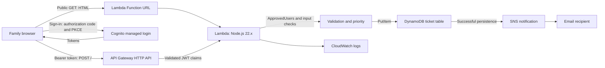

# Family IT Help Desk
**v0.1 COMPLETE — September 13, 2026 EDT / September 14 UTC**  
**v0.2: IN PROGRESS — authenticated admin/status workflow implemented and under validation · v0.3: planned**

## Objective
Turn family technology problems into authenticated, persistent tickets with automatic priority, immediate email notification, and a usable confirmation page. v0.1 is a working serverless application, with category-specific humor supplied by ordinary code.

## Implemented architecture

The function serves the frontend and processes the API integration in us-east-2. The actual frontend is a Lambda Function URL. **CloudFront is not deployed** in the accepted architecture. The diagram expresses application ordering; DynamoDB does not directly trigger SNS.

## Implementation
Built incrementally: HTTP blueprint → frontend → server-generated ticket ID and priority → DynamoDB persistence → SNS email → Cognito approval and API Gateway JWT integration → final UI acceptance.

DynamoDB uses ticketId as its string partition key, without a sort key or secondary indexes. Provisioned capacity was selected for the small workload. The execution role has logging access and scoped application permissions for ticket persistence/management and SNS publication. Ticket data is stored before notification. The exact live IAM action set should be re-audited before publishing a narrower claim.

The branded Cognito login supports email self-registration and verification. ApprovedUsers is the application approval group. The browser app uses authorization-code/PKCE without a client secret; its approval refresh reads the access-token group claim. A 90-day refresh-token lifetime and 60-minute access/ID tokens were recorded, not a guarantee of uninterrupted sessions.

## Security decisions
API Gateway protects POST / using JWT validation. Lambda's recorded implementation checks the approved group and rejects write requests without validated API Gateway claims, including the direct Function URL write path. Frontend visibility is a usability control, not the authorization boundary.

The public GET path loads the app before authentication. CORS is restricted to the real frontend origin. Account IDs, private email addresses, tokens, live endpoint addresses, and raw ticket data are omitted here. The lab's recorded Cognito configuration did not enable MFA; this is documented as the v0.1 choice, not represented as production hardening.

## Acceptance evidence
| Check | Recorded result |
|---|---|
| Pending approval | Only the approval panel visible |
| Approved user | Help Desk content appears after approval refresh |
| Initial stages | Stage 1 only before submission |
| Final submission | Backend ticket ID returned; Medium priority; Submitted status |
| Persistence | Same final test ticket visible in DynamoDB; scan returned two items |
| Notification | Owner explicitly confirmed email receipt |
| Successful stages | Stage 2 appears; stages 3–4 remain hidden |
| Earlier security-category test | Critical priority and security warning returned |

The final UI receipt and matching database screenshot were inspected during the documentation reconciliation. This is prior acceptance evidence, not a fresh live AWS test. Separate post-hardening negative API tests, exhaustive priority tests, sustained-load testing, restore testing, and current billing verification are not claimed.

## Troubleshooting
- A nonexistent CloudFront hostname caused DNS failure. The app was aligned to the actual Function URL, including Cognito callbacks and CORS.
- Cognito redirect mismatch exposed the need for exact callback consistency.
- Protecting GET / blocked the page before it could acquire a JWT; only the submission path remained protected.
- CORS entries had to be committed as console tags before saving.
- Pending-user gating initially hid only the form, leaving other workflow content visible. The complete approved area was gated.
- Later stages were initially rendered too early. They now appear only when supported by the current workflow.
- An accidentally cancelled SNS subscription was restored and confirmed; final email delivery passed.

## Cost and retained operation
Target: $0 additional out-of-pocket. The owner chose to keep this useful app available. Lambda, API Gateway, Cognito, DynamoDB, SNS, logging, and the budget are retained intentionally. Actual ongoing cost and the Lambda promotional award have not been verified in the reviewed record. No AI inference is required for v0.1.

If retiring the app later, first preserve any needed ticket data privately, then remove the API/function URL/function, table, topic/subscription, user pool/client, project-specific permissions, and unneeded logs. This is a retirement plan, not a teardown already performed.

## Lessons learned
Build one integration at a time and verify persistence and notification separately. A successful UI cannot alone prove database storage or email delivery. Keep presentation state honest: a created ticket is not yet in progress or resolved. Preserve the accepted v0.1 instead of reopening it for optional features.

## v0.2 progress and bounded roadmap
- **Implemented/observed:** Cognito `HelpDeskAdmins` group; protected admin ticket retrieval; Manage Tickets UI; backend status update path; restored-ticket rendering from authoritative backend state; successful `Submitted → In Progress` update with Stage 3 and the user-facing status synchronized after refresh.
- **Still to validate before v0.2 completion:** `In Progress → Resolved` end-to-end, Stage 4 rendering, a fresh-ticket regression check, removal of temporary browser debug instrumentation, and a final server-side authorization/IAM review.
- **v0.2 boundary:** authenticated admin list/detail/status management and `Submitted → In Progress → Resolved`; optional notes, assignments, analytics, search, reopening, attachments, and broader integrations remain outside the minimum.
- **v0.3:** optional Bedrock troubleshooting with bounded requests/conversations. Security-sensitive or high-priority issues bypass AI and escalate deterministically. The core help desk must work without AI.

[Completion record](../../COMPLETION-RECORD.md) · [Cloud portfolio](../../../README.md)
